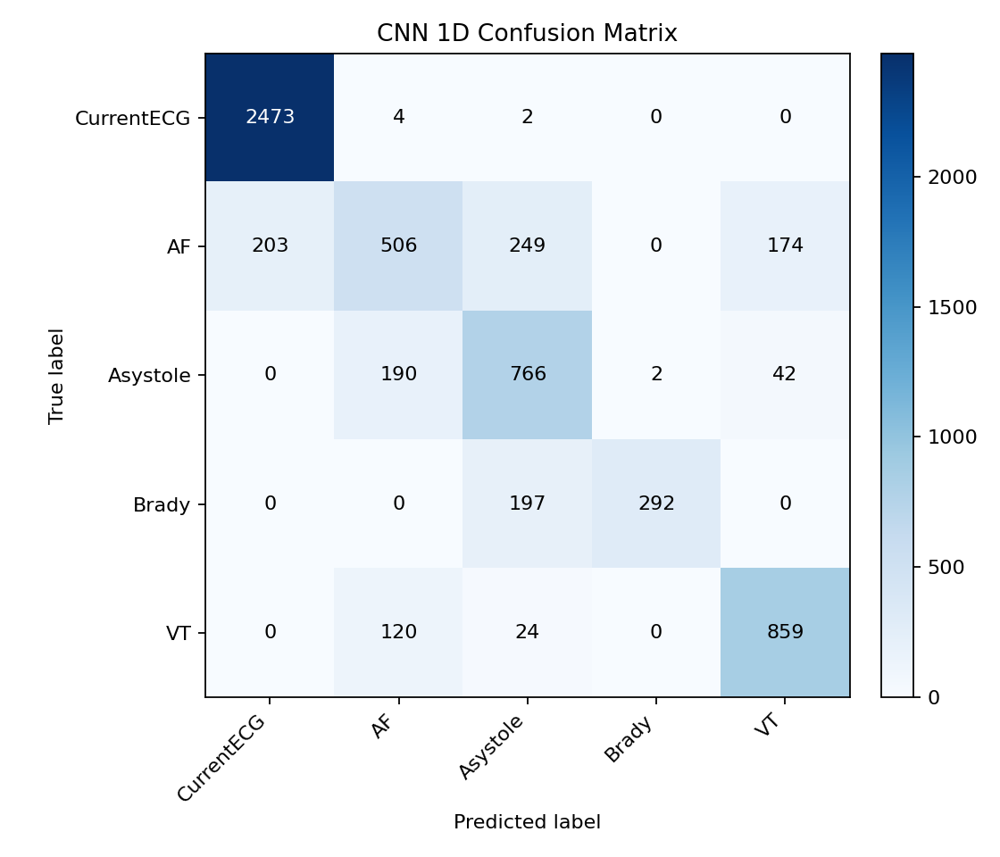
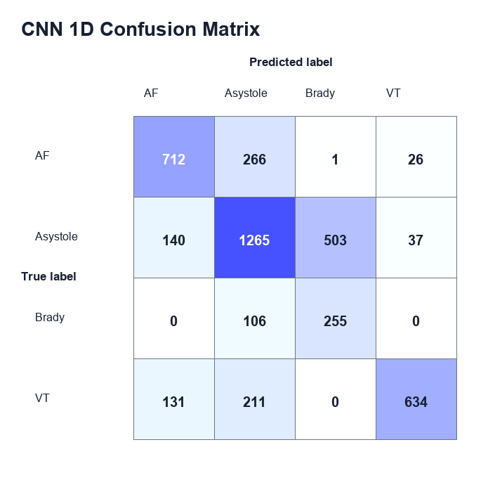
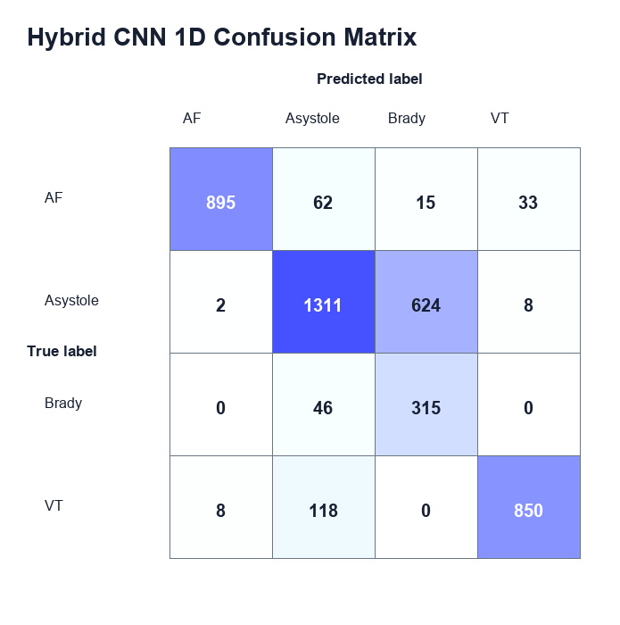
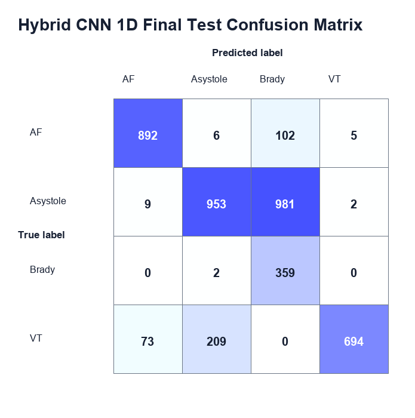
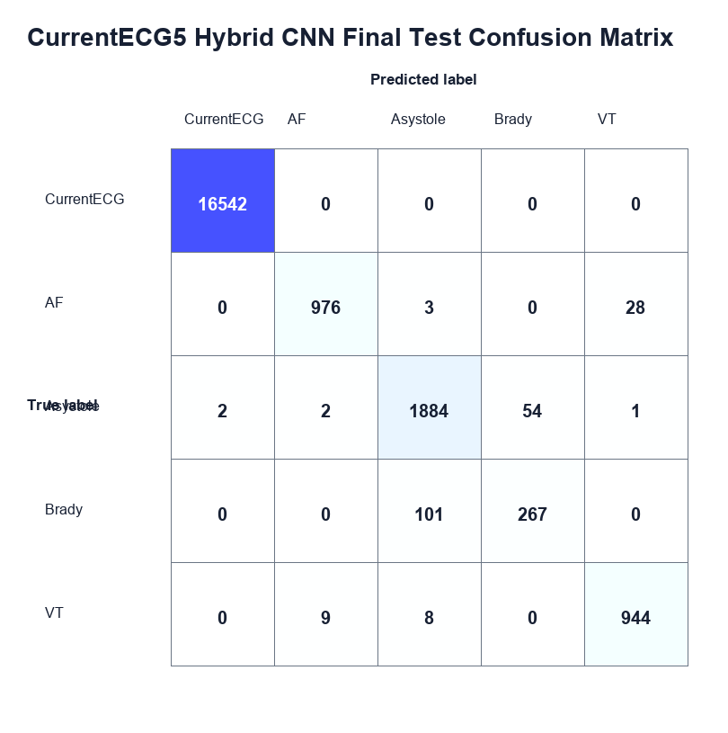
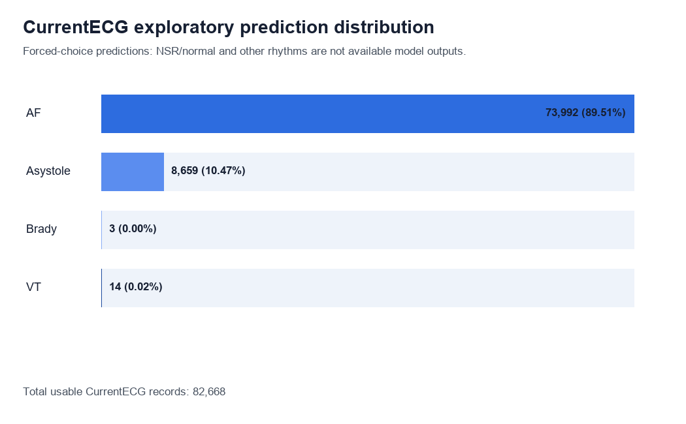
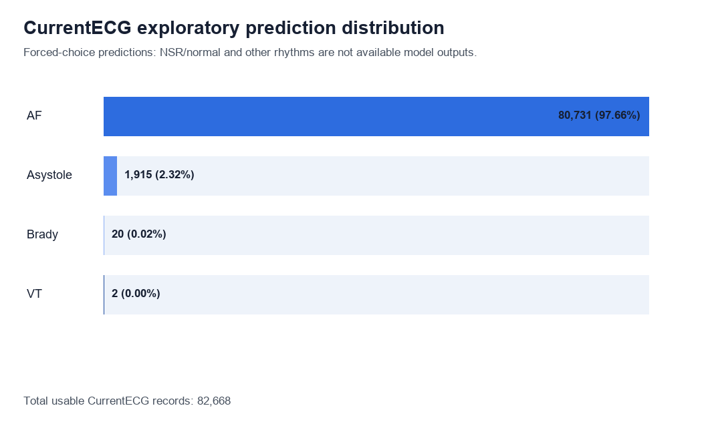

# Aggregate Results

Only lightweight aggregate outputs are stored here. Record-level predictions,
raw XML/PDD files and occurrence arrays are intentionally excluded.

## Validated Test Set

| Model | Accuracy | Macro F1 | Weighted F1 |
|---|---:|---:|---:|
| Waveform-only CNN 1D | 0.6685 | 0.6491 | 0.6814 |
| Hybrid CNN 1D | 0.7863 | 0.7700 | 0.8090 |

Historical first CNN prototype:

| Model | Accuracy | Macro F1 | Weighted F1 |
|---|---:|---:|---:|
| CNN 1D clinical5 | 0.8022 | 0.75 | 0.79 |

The hybrid model combines ECG morphology with rhythm and marker features.

The table above preserves the historical prototype comparison. The corrected
final protocol uses device-disjoint train, validation and test sets:

| Final protocol | Accuracy | Macro F1 | Weighted F1 |
|---|---:|---:|---:|
| Hybrid CNN 1D train/validation/test | 0.6760 | 0.6848 | 0.7109 |

The final test set is evaluated once after checkpoint selection on validation
within the corrected run. Its groups match the historical iteration-2 holdout,
so this is an internal evaluation rather than external validation. Its main
limitation is confusion between `Asystole` and `Brady`.

After tutor feedback, a new five-class supervised iteration uses `CurrentECG`
as a label while preserving its original name. This version uses all usable
records from the five selected classes and handles imbalance with class weights:

| Final protocol | Accuracy | Macro F1 | Weighted F1 |
|---|---:|---:|---:|
| Hybrid CNN 1D CurrentECG5 + Optuna | 0.9900 | 0.9373 | 0.9898 |

`CurrentECG` is interpreted as an operational baseline/non-arrhythmic class
under the tutor's assumption. It is not renamed to confirmed clinical NSR.

## Exploratory CurrentECG Cohort

`CurrentECG` does not provide confirmed diagnostic labels. Its outputs are
exploratory forced-choice predictions, not validated diagnoses.

| Predicted output | Records | Percentage |
|---|---:|---:|
| AF | 73,992 | 89.51% |
| Asystole | 8,659 | 10.47% |
| Brady | 3 | <0.01% |
| VT | 14 | 0.02% |

The model has no confirmed NSR/normal or other/indeterminate output. The strong
AF concentration must not be interpreted as clinical prevalence.

With the corrected final checkpoint, the exploratory distribution is:

| Predicted output | Records | Percentage |
|---|---:|---:|
| AF | 80,731 | 97.66% |
| Asystole | 1,915 | 2.32% |
| Brady | 20 | 0.02% |
| VT | 2 | <0.01% |

